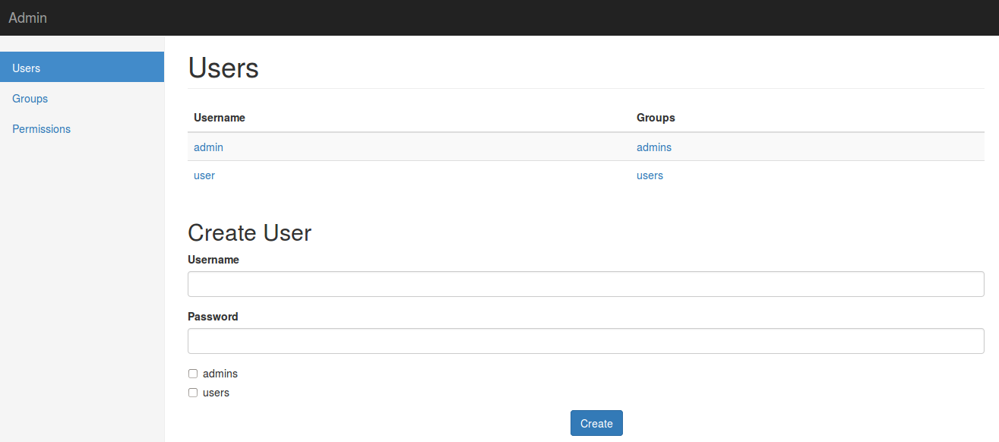

Users, Groups and Permissions
=============================

Now that we exposed metrics through our REST API we may want to restrict its
access to only some users, for that we will need at least users and
permissions.

Luckily riak_core provides support for users, groups and permissions built in,
the module that provides it is riak_core_security, in a later chapter we
explore the module in detail, but for now let's use some libraries to get
ourself started fast.

For this we will a library called `rcs_cowboy <https://github.com/marianoguerra/rcs_cowboy>`_ which exposes riak_core_security API through cowboy. But since
doing HTTP calls to handle our users is a little bit annoying we will also
use a project called `iorioui <https://github.com/marianoguerra/iorioui>`_ which
is a ui for the API exposed by rcs_cowboy.

Let's get started!

As usual we start by `adding the dependency for rcs_cowboy <https://github.com/marianoguerra/tanodb/commit/a18de393b76a2e64da600c26706b4f01e01152bc#diff-31d7a50c99c265ca2793c20961b60979R8>`_ 

.. note::

    At the moment there's a `hack <https://github.com/marianoguerra/tanodb/commit/a18de393b76a2e64da600c26706b4f01e01152bc#diff-31d7a50c99c265ca2793c20961b60979R102>`_ where we add a compiler flag to export all
    functions from riak_core since riak_core_security doesn't export the
    get_context function and rcs_cowboy needs it.

    Alternatives would be to fork riak_core or copy the riak_core_security
    module and export the function or replicate get_context in another module,
    for now to avoid complications we use this hack.

Since we need permissions to manage we need to `uncomment the configuration in
config/advanced.config <https://github.com/marianoguerra/tanodb/commit/a18de393b76a2e64da600c26706b4f01e01152bc#diff-d7bbf2e51e9fbed2475374becbaf8b48R6>`_ to list the permissions that our app allows. 

We also need to `add the cowboy routes for rcs_cowboy <https://github.com/marianoguerra/tanodb/commit/a18de393b76a2e64da600c26706b4f01e01152bc#diff-4477d4dd0aa2db0e274a56c9158207bdR74>`_, read `the readme of rcs_cowboy <https://github.com/marianoguerra/rcs_cowboy/blob/master/README.rst>`_ for details.

Since we need to login to the admin ui, we need to ensure that at least there's
a user available, for that `we ensure that there are 2 users and 2 groups by
default <https://github.com/marianoguerra/tanodb/commit/a18de393b76a2e64da600c26706b4f01e01152bc#diff-4477d4dd0aa2db0e274a56c9158207bdR54>`_ and we `call
the setup function during startup <https://github.com/marianoguerra/tanodb/commit/a18de393b76a2e64da600c26706b4f01e01152bc#diff-4477d4dd0aa2db0e274a56c9158207bdR19>`_

For now session management will be weak since it's not our focus at the moment,
this means that when rcs_cowboy calls us to provide a response with a session
token `we return a fixed token <https://github.com/marianoguerra/tanodb/commit/a18de393b76a2e64da600c26706b4f01e01152bc#diff-4477d4dd0aa2db0e274a56c9158207bdR31>`_ and when rcs_cowboy calls us to check if a request is authorized (the ui
will send us back the token we returned in the X-Session header), `we say always
that it's authorized <https://github.com/marianoguerra/tanodb/commit/a18de393b76a2e64da600c26706b4f01e01152bc#diff-4477d4dd0aa2db0e274a56c9158207bdR64>`_.

Finally we copy the files from iorioui under `apps/tanodb/priv/ui/admin <https://github.com/marianoguerra/tanodb/tree/a18de393b76a2e64da600c26706b4f01e01152bc/apps/tanodb/priv/ui/admin>`_ and `add a cowboy static route to serve the static files <https://github.com/marianoguerra/tanodb/commit/a18de393b76a2e64da600c26706b4f01e01152bc#diff-4477d4dd0aa2db0e274a56c9158207bdR76>`_. Read more about cowboy static file serving in the `cowboy's page for cowboy_static <http://ninenines.eu/docs/en/cowboy/1.0/manual/cowboy_static/>`_.

Now do the usual process of stop, build and run, but before running, in case
you were playing with users and groups you can remove the folder that contains
that data so you start from scratch and users and groups are created correctly,
to do this run:

.. code-block:: sh

    rm -r _build/default/rel/tanodb_data/cluster_meta

Once the server is running open http://http://localhost:8080/ui/admin/index.html with your browser, you should see something like this:

.. image:: ../images/rcs_cowboy_1.png

Login with user `admin` and password `secret`, then you should see something
like this:

.. raw:: latex

    \newpage

Riak Core Security Model
------------------------

The riak_core_security module provides a security model that contains 4 main
elements:

Users
    Usernames and passwords as usual, users can belong to groups,
    a user inherits the permissions of the groups it belongs.

Groups
    A group has a name and can belong to other groups, a group inherits the
    permissions of the groups it belongs.

Grants
    A grant is a rule that says that a user or group has permission to do
    something on a resource, a permission is a string composed of the app name
    and the permission name joined by a dot as a string, for example
    "tanodb.get".

    The meaning of permissions is given by your application
    logic by checking for specific permissions when an operation is requested
    on a resource.

    The list of valid permissions for your app is defined in the file
    config/advanced.config.

Resources
    Riak Core allows you to apply grants to a bucket or a bucket/key pair, a
    bucket is like a namespace for keys, you can have the same key in two
    different buckets and they mean different things.

    For example you could assign one bucket to each user or something else,
    the use of buckets and keys is defined by your application.
