Little Riak Core Talk
=====================

Mariano Guerra

Ricon 2015 | San Francisco | November 4-6th, 2015

About This Talk
===============

* Overview of `Little Riak Core Book <http://marianoguerra.github.io/little-riak-core-book/>`_ (~60 page html/pdf/epub)
* Step by Step creation of `tanodb <https://github.com/marianoguerra/tanodb>`_

  + In memory key value store with a REST API

* Will go fast
* Don't worry, all is written down in the book
* Provide all the tools, features and concepts
* So you can focus on the distributed part

About Me
========

* Argentinian
* Software Engineer
* Python, Clojure[script], Erlang, Javascript, `Efene <http://efene.org/>`_ ;)
* Co-Founder of `Event Fabric <http://event-fabric.com/>`_

  + Build Custom Real Time Dashboards on the Web without Code

Tools
=====

* `Erlang >= 17 <http://erlang.org/>`_
* `rebar3 <http://rebar3.org/>`_: build tool

  + `relx <https://github.com/erlware/relx>`_: rebar3 release
  + `cuttlefish <https://github.com/basho/cuttlefish>`_: config generation and validation
  + `rebar3_run <https://github.com/tsloughter/rebar3_run>`_: rebar3 run

* `rebar3_template_riak_core <https://github.com/marianoguerra/rebar3_template_riak_core/>`_: project template

Initial Setup
=============

* `Install rebar3 <http://www.rebar3.org/docs/getting-started>`_
* Install Template

.. class:: prettyprint lang-sh

::

    mkdir -p ~/.config/rebar3/templates
    git clone https://github.com/marianoguerra/rebar3_template_riak_core/ \
        ~/.config/rebar3/templates/rebar3_template_riak_core

Initial Setup
=============

* Create Project

.. class:: prettyprint lang-sh

::

    rebar3 new rebar3_riak_core name=tanodb

Project Structure
=================

.. class:: prettyprint lang-sh

::

    ===> Writing tanodb/apps/tanodb/src/tanodb.app.src
    ===> Writing tanodb/apps/tanodb/src/tanodb.erl
    ===> Writing tanodb/apps/tanodb/src/tanodb_app.erl
    ===> Writing tanodb/apps/tanodb/src/tanodb_sup.erl
    ===> Writing tanodb/apps/tanodb/src/tanodb_console.erl
    ===> Writing tanodb/apps/tanodb/src/tanodb_vnode.erl
    ===> Writing tanodb/rebar.config
    ===> Writing tanodb/.editorconfig
    ===> Writing tanodb/.gitignore
    ===> Writing tanodb/README.rst
    ===> Writing tanodb/Makefile

Project Structure
=================

.. class:: prettyprint lang-sh

::

    ===> Writing tanodb/config/nodetool
    ===> Writing tanodb/config/extended_bin
    ===> Writing tanodb/config/admin_bin
    ===> Writing tanodb/config/config.schema
    ===> Writing tanodb/config/advanced.config
    ===> Writing tanodb/config/sys.config
    ===> Writing tanodb/config/vars.config
    ===> Writing tanodb/config/vars_dev1.config
    ===> Writing tanodb/config/vars_dev2.config
    ===> Writing tanodb/config/vars_dev3.config
    ===> Writing tanodb/config/vm.args
    ===> Writing tanodb/config/dev1_vm.args
    ===> Writing tanodb/config/dev2_vm.args
    ===> Writing tanodb/config/dev3_vm.args

Building and Running
====================

.. class:: prettyprint lang-sh

::

    cd tanodb
    rebar3 release
    rebar3 run

.. class:: prettyprint lang-sh

::

    _build/default/

Try It
======

.. class:: prettyprint lang-erlang

::

    (tanodb@127.0.0.1)1> tanodb:ping().
    {pong,1347321821914426127719021955160323408745312813056}

    (tanodb@127.0.0.1)1> q().

From now on Partition IDs will look like **13...**, but they are that long

Clustering
==========

.. class:: prettyprint lang-sh

::

    make devrel

.. class:: prettyprint lang-sh

::

    _build/dev1
    _build/dev2
    _build/dev3

.. class:: prettyprint lang-sh

::

    make dev1-console
    make dev2-console
    make dev3-console

Joining Nodes
=============

.. class:: prettyprint lang-sh

::

    make devrel-join

.. class:: prettyprint lang-sh

::

    make devrel-status

.. class:: prettyprint lang-sh

::

    ================================= Membership ===============
    Status     Ring    Pending    Node
    ------------------------------------------------------------
    joining     0.0%      --      'tanodb2@127.0.0.1'
    joining     0.0%      --      'tanodb3@127.0.0.1'
    valid     100.0%      --      'tanodb1@127.0.0.1'
    ------------------------------------------------------------
    Valid:1 / Leaving:0 / Exiting:0 / Joining:2 / Down:0

Checking the Plan
=================

.. class:: prettyprint lang-sh

::

    make devrel-cluster-plan

.. class:: prettyprint lang-sh

::

    =============================== Staged Changes ==============
    Action         Details(s)
    -------------------------------------------------------------
    join           'tanodb2@127.0.0.1'
    join           'tanodb3@127.0.0.1'
    -------------------------------------------------------------

    NOTE: Applying these changes will result in 1 cluster transition

Checking the Plan
=================

.. class:: prettyprint lang-sh

::

    #############################################################
                             After cluster transition 1/1
    #############################################################

    ================================= Membership ================
    Status     Ring    Pending    Node
    -------------------------------------------------------------
    valid     100.0%     34.4%    'tanodb1@127.0.0.1'
    valid       0.0%     32.8%    'tanodb2@127.0.0.1'
    valid       0.0%     32.8%    'tanodb3@127.0.0.1'
    -------------------------------------------------------------
    Valid:3 / Leaving:0 / Exiting:0 / Joining:0 / Down:0

    WARNING: Not all replicas will be on distinct nodes

    Transfers resulting from cluster changes: 42
      21 transfers from 'tanodb1@127.0.0.1' to 'tanodb3@127.0.0.1'
      21 transfers from 'tanodb1@127.0.0.1' to 'tanodb2@127.0.0.1'

Committing Changes
==================

.. class:: prettyprint lang-sh

::

    make devrel-cluster-commit

::

    Cluster changes committed

Checking Handoff
================

.. class:: prettyprint lang-sh

::

    make devrel-status

.. class:: prettyprint lang-sh

::

    ================================= Membership =============
    Status     Ring    Pending    Node
    ----------------------------------------------------------
    valid      75.0%     34.4%    'tanodb1@127.0.0.1'
    valid       9.4%     32.8%    'tanodb2@127.0.0.1'
    valid       7.8%     32.8%    'tanodb3@127.0.0.1'
    ----------------------------------------------------------
    Valid:3 / Leaving:0 / Exiting:0 / Joining:0 / Down:0

Checking Handoff
================

.. class:: prettyprint lang-sh

::

    ================================= Membership ==============
    Status     Ring    Pending    Node
    -----------------------------------------------------------
    valid      34.4%      --      'tanodb1@127.0.0.1'
    valid      32.8%      --      'tanodb2@127.0.0.1'
    valid      32.8%      --      'tanodb3@127.0.0.1'
    -----------------------------------------------------------
    Valid:3 / Leaving:0 / Exiting:0 / Joining:0 / Down:0

Stopping All
============

.. class:: prettyprint lang-sh

::

    make devrel-stop

Building a Production Release
=============================

.. class:: prettyprint lang-sh

::

    rebar3 as prod release

Trying it on a Clean Server
===========================

.. class:: prettyprint lang-sh

::

    mkdir vm-ubuntu-1504
    cd vm-ubuntu-1504

Vagrantfile:

.. class:: prettyprint lang-ruby

::

    Vagrant.configure(2) do |config|
      config.vm.box = "ubuntu/vivid64"
      config.vm.provider "virtualbox" do |vb|
        vb.memory = "1024"
      end
    end

.. class:: prettyprint lang-sh

::

    vagrant up

Trying it on a Clean Server
===========================

.. class:: prettyprint lang-sh

::

    cd _build/prod/rel
    tar -czf tanodb.tgz tanodb
    cd -
    mv _build/prod/rel/tanodb.tgz vm-ubuntu-1504
    export TERM=xterm
    vagrant ssh
    cp /vagrant/tanodb.tgz .
    tar -xzf tanodb.tgz
    ./tanodb/bin/tanodb console

Ping as a Service (PaaS)
========================

* Add `Cowboy <ninenines.eu/docs/en/cowboy/1.0/>`_ and `jsx <https://github.com/talentdeficit/jsx>`_ deps to rebar.config
* Add Route in tanodb_app
* Create tanodb_http_ping cowboy rest handler

.. class:: prettyprint lang-sh

::

    rebar3 release
    rebar3 run

Ping as a Service (PaaS)
========================

.. class:: prettyprint lang-sh

::

    http localhost:8080/ping

.. class:: prettyprint lang-http

::

    HTTP/1.1 200 OK
    content-length: 59
    content-type: application/json
    date: Thu, 29 Oct 2015 19:07:23 GMT
    server: Cowboy

    {
    "pong": "981946412581700398168100746981252653831329677312"
    }

Changing Configuration
======================

.. class:: prettyprint lang-sh

::

    _build/default/rel/tanodb/etc/tanodb.conf

.. class:: prettyprint lang-python

::

    ## Enable/Disable HTTP API
    ## Default: yes
    ## Acceptable values:
    ##   - yes or no
    http.enabled = yes

    ## port to listen to for HTTP API
    ## Default: 8080
    ## Acceptable values:
    ##   - an integer
    http.port = 8080

    ## number of acceptors to user for HTTP API
    ## Default: 100
    ## Acceptable values:
    ##   - an integer
    http.acceptors = 100

Changing Configuration
======================

.. class:: prettyprint lang-sh

::

    http localhost:8081/ping

Metrics
=======

* `exometer <https://github.com/Feuerlabs/exometer>`_ (same as riak_core)
* Our metrics and riak_core metrics

.. class:: prettyprint lang-erlang

::

    (tanodb@127.0.0.1)1> tanodb_metrics:all().
    [{tanodb,[
     ...
     {core,[{ping,[{count,0},{one,0}]}]}]

    (tanodb@127.0.0.1)2> tanodb:ping().
    {pong,593735040165679310520246963290989976735222595584}

    (tanodb@127.0.0.1)3> tanodb_metrics:all().
    [{tanodb,[
     ...
     {core,[{ping,[{count,1},{one,1}]}]}]

VM Metrics
==========

* `recon <https://github.com/ferd/recon>`_

.. class:: prettyprint lang-erlang

::

    (tanodb@127.0.0.1)1> tanodb_metrics:all().
    [{tanodb,[...
     {node,[{abs,[{process_count,377},
                  {run_queue,0}, {error_logger_queue_len,0},
                  {memory_total,30418240},
                  {memory_procs,11745496}, {memory_atoms,458994},
                  {memory_bin,232112}, {memory_ets,1470872}]},
            {inc,[{bytes_in,11737}, {bytes_out,2470},
                  {gc_count,7}, {gc_words_reclaimed,29948},
                  {reductions,2601390},
                  {scheduler_usage,[{1,0.9291112866248371},
                                    {2,0.04754016011809648},
                                    {3,0.04615958261183974},
                                    {4,0.03682005933534583}]}]}]},
     {core,[{ping,[{count,0},{one,0}]}]}]

Web Server Metrics
==================

* `cowboy_exometer <https://github.com/marianoguerra/cowboy_exometer>`_

  + Middleware and response hooks

.. class:: prettyprint lang-erlang

::

    (tanodb@127.0.0.1)1> tanodb_metrics:all().
    [{tanodb,[ ...
     {http,[{resp,[{by_code,[{200,[{count,1},{one,1}]},
                             {201,[{count,0},{one,0}]},
                             {202,[{count,0},{one,0}]},
                             ...
                             {400,[...]}, {401,...}, {...}|...]}]},
            {req,[{time,[{<<"ping">>,
                          [{n,3}, {mean,44126}, {median,44126},
                           {min,44126}, {max,44126},
                           {50,0}, {75,44126}, {90,44126},
                           {95,44126}, {99,44126}, {999,44126}]}]},
                  {active,[{value,0},{ms_since_reset,11546}]},
                  {count,[{<<"ping">>,[{count,1},{one,1}]}]}]}]},
                  ...]

Metrics Via HTTP
================

.. class:: prettyprint lang-sh

::

    $ http localhost:8080/metrics

.. class:: prettyprint lang-http

::

    HTTP/1.1 200 OK
    content-type: application/json

    {
        "core": { "ping": { "count": 2, "one": 1 } },
        "http": {
            "req": {
                "active": { "ms_since_reset": 279958, "value": 1 },
                "count": {
                    "metrics": { "count": 1, "one": 0 },
                    "ping": { "count": 2, "one": 1 }
                },

Metrics Via HTTP
================

.. class:: prettyprint lang-http

::

                "time": {
                    "metrics": {
                        "50": 0, "75": 0, "90": 0, "95": 0, "99": 0, "999": 0,
                        "max": 0, "mean": 0, "median": 0, "min": 0, "n": 0
                    },
                    "ping": {
                        "50": 0, "75": 349, "90": 349, "95": 349, "99": 349,
                        "999": 349, "max": 349, "mean": 349, "median": 349,
                        "min": 349, "n": 3
                    }
                }
            },

Metrics Via HTTP
================

.. class:: prettyprint lang-http

::

            "resp": {
                "by_code": {
                    "200": { "count": 3, "one": 1 },
                    "201": { "count": 0, "one": 0 }, ...
                    "400": { "count": 0, "one": 0 },
                    "401": { "count": 0, "one": 0 }, ...
                    "404": { "count": 0, "one": 0 }, ...
                    "500": { "count": 0, "one": 0 }, ...
                }
            }
        },
        "node": { ...  },
        "tanodb": { ...  }
    }

Metrics Extra
=============

* `lager exometer backend <https://github.com/marianoguerra/lager_exometer_backend>`_

  + lager backend
  + sends log metrics by level to exometer

Users, Groups and Permissions
=============================

* riak_core provides riak_core_security module

  + Roles: Users and Groups
  + Permissions
  + Grants
  + Resources

Exposing riak_core_security
===========================

* `rcs_cowboy <https://github.com/marianoguerra/rcs_cowboy>`_

  + Cowboy rest handler
  + Utility library
  + REST API for riak_core_security
  + As a library

riak_core_security UI
=====================

* `iorioui <https://github.com/marianoguerra/iorioui>`_

  + clojurescript + om.next + bootstrap
  + Web Admin for riak_core_security
  + Uses rcs_cowboy

rcs_cowboy and iorioui
======================

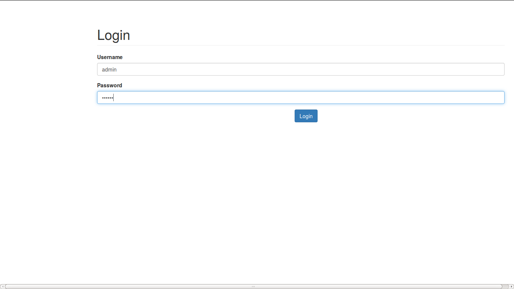

rcs_cowboy and iorioui
======================

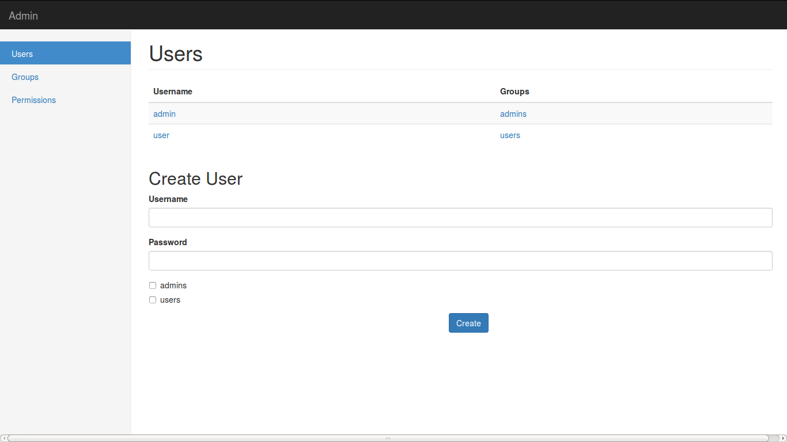

rcs_cowboy and iorioui
======================

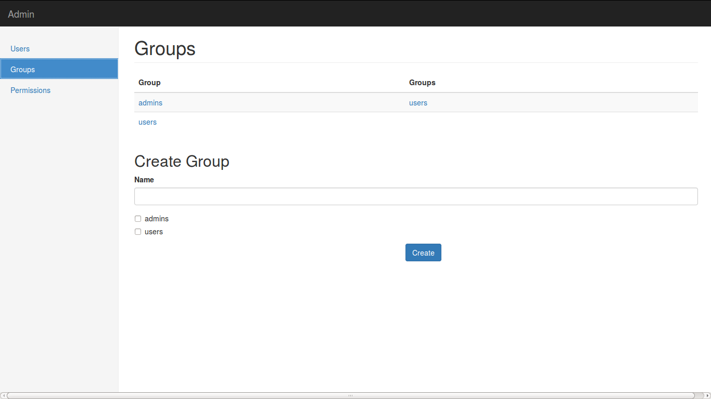

rcs_cowboy and iorioui
======================

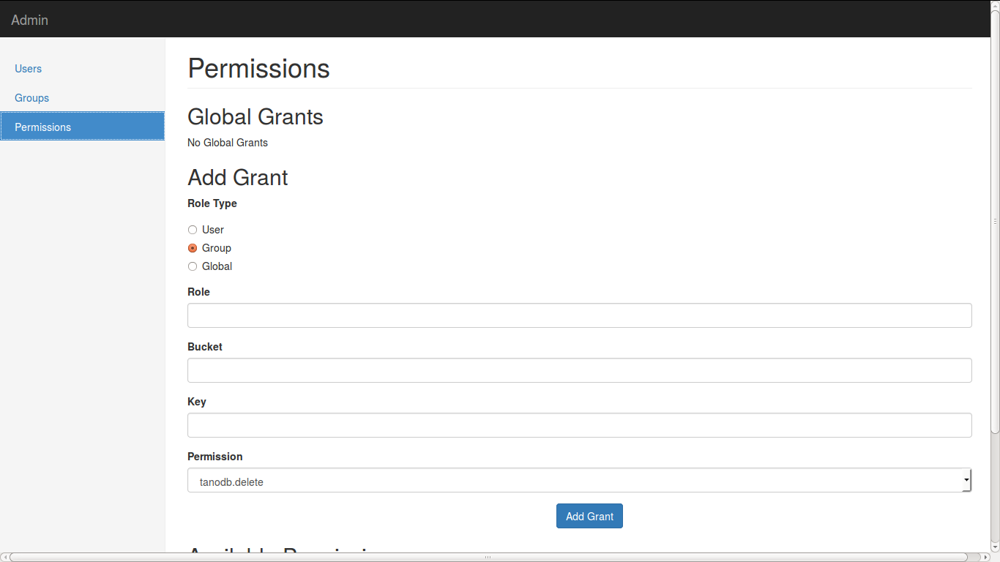

rcs_cowboy and iorioui
======================

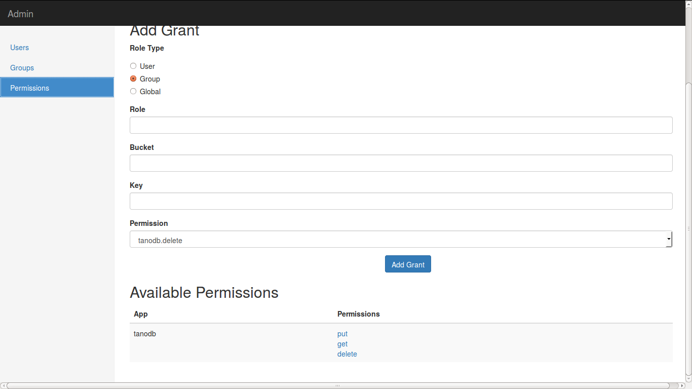

rcs_cowboy and iorioui
======================

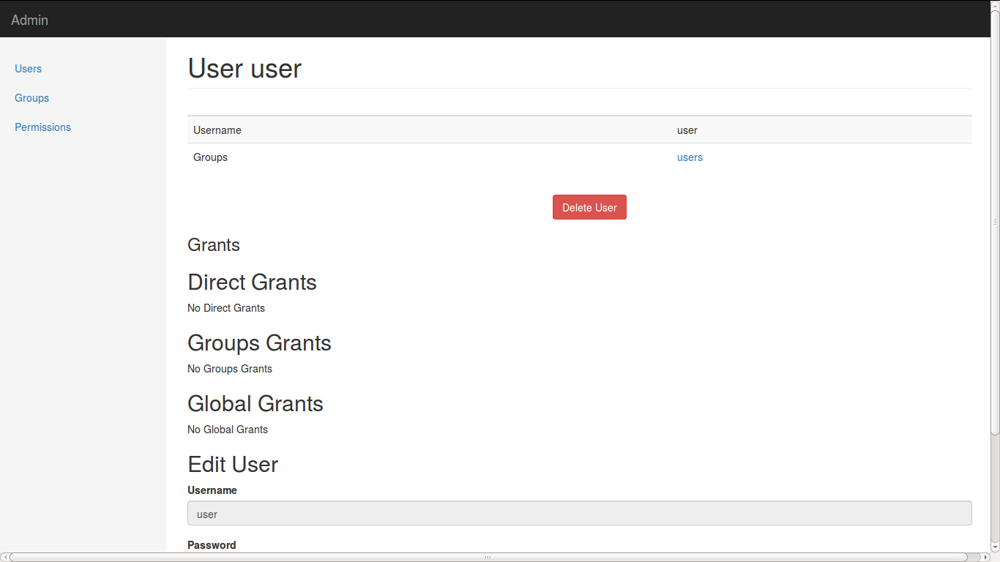

rcs_cowboy and iorioui
======================

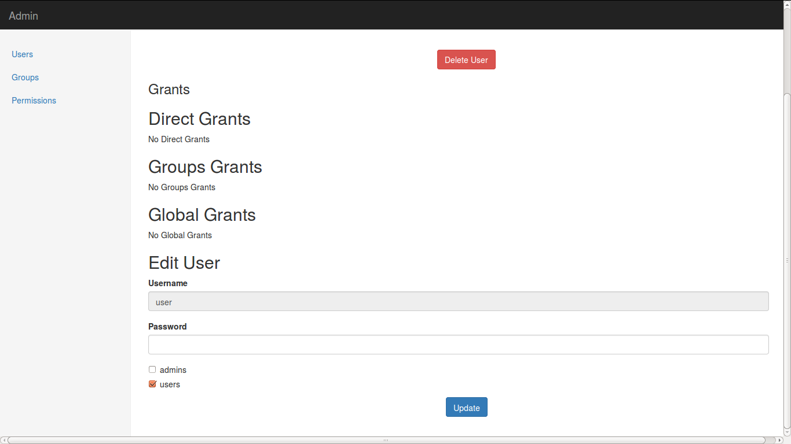

rcs_cowboy and iorioui
======================

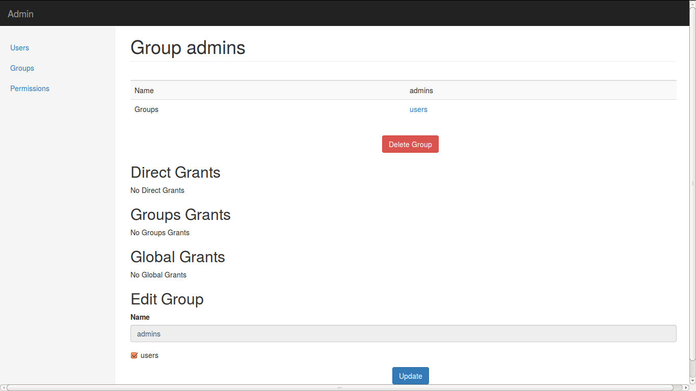

rcs_cowboy and iorioui
======================

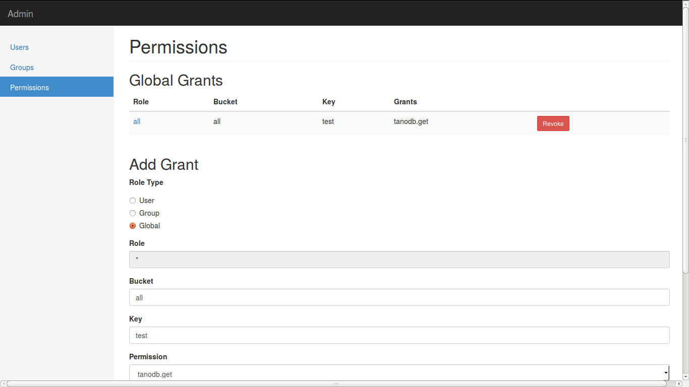

rcs_cowboy and iorioui
======================

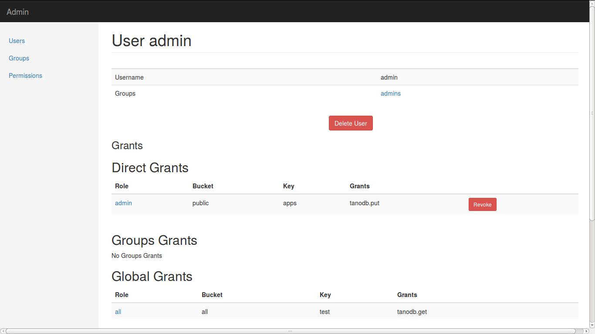

rcs_cowboy and iorioui
======================

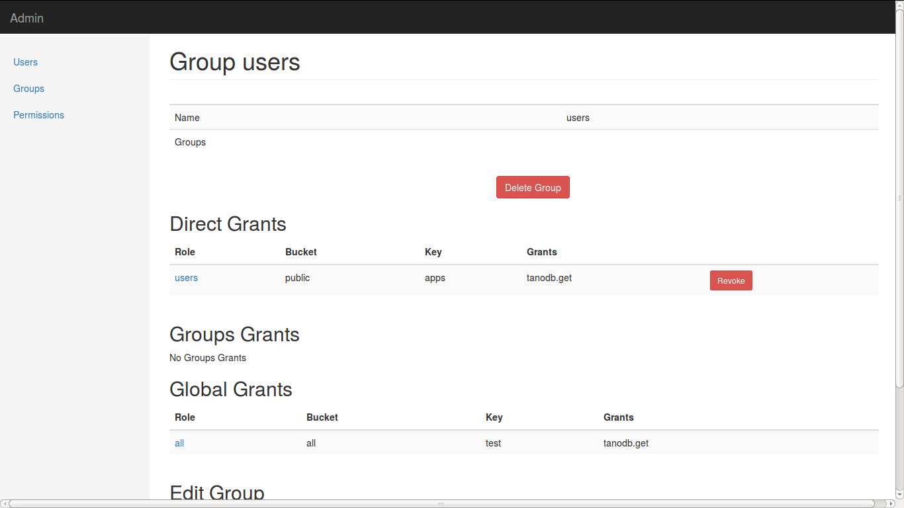

rcs_cowboy and iorioui
======================

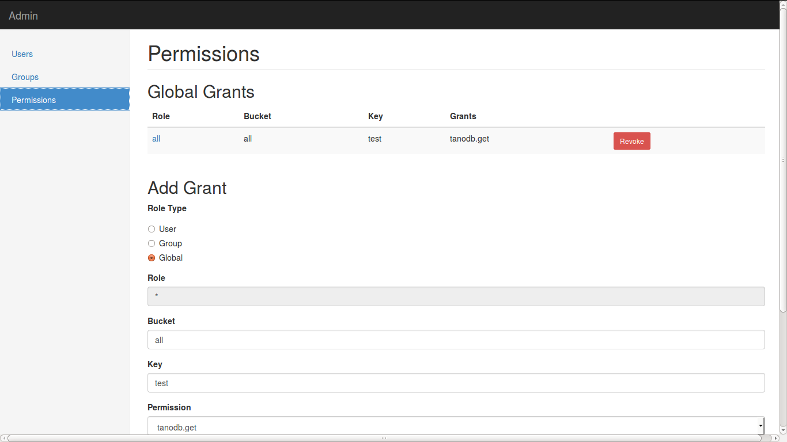

Ping Implementation
===================

.. class:: prettyprint lang-erlang

::

    ping() ->
        tanodb_metrics:core_ping(),

        DocIdx = riak_core_util:chash_key({<<"ping">>,
                                    term_to_binary(os:timestamp())}),

        PrefList = riak_core_apl:get_primary_apl(DocIdx, 1, tanodb),

        [{IndexNode, _Type}] = PrefList,

        riak_core_vnode_master:sync_spawn_command(IndexNode, ping,
                                                tanodb_vnode_master).

Ping Implementation
===================

.. class:: prettyprint lang-erlang

::

    (tanodb@127.0.0.1)1> DocIdx = riak_core_util:chash_key({<<"ping">>, term_to_binary(os:timestamp())}).

    <<126,9,218,77,97,108,38,92,0,155,160,26,161,3,200,87,134,213,167,168>>

.. class:: prettyprint lang-erlang

::

    (tanodb@127.0.0.1)2> PrefList = riak_core_apl:get_primary_apl(DocIdx, 1, tanodb).

    [{{73..., 'tanodb@127.0.0.1'}, primary}]

Ping Implementation
===================

.. class:: prettyprint lang-erlang

::

    (tanodb@127.0.0.1)3> PrefList2 = riak_core_apl:get_primary_apl(DocIdx, 2, tanodb).

    [{{73..., 'tanodb@127.0.0.1'}, primary},
     {{75..., 'tanodb@127.0.0.1'}, primary}]

Ping Implementation
===================

.. class:: prettyprint lang-erlang

::

    (tanodb@127.0.0.1)5> [{IndexNode, _Type}] = PrefList.

    [{{73..., 'tanodb@127.0.0.1'}, primary}]

.. class:: prettyprint lang-erlang

::

    (tanodb@127.0.0.1)6> riak_core_vnode_master:sync_spawn_command(IndexNode, ping, tanodb_vnode_master).

    {pong,73...}

Ping Implementation
===================

.. class:: prettyprint lang-erlang

::

    (tanodb@127.0.0.1)7> [{IndexNode1, _Type1}, {IndexNode2, _Type2}] = PrefList2.

    [{{73..., 'tanodb@127.0.0.1'}, primary},
     {{75..., 'tanodb@127.0.0.1'}, primary}]

.. class:: prettyprint lang-erlang

::

    (tanodb@127.0.0.1)9> riak_core_vnode_master:sync_spawn_command(IndexNode2, ping, tanodb_vnode_master).

    {pong,75...}

Ping Implementation
===================

.. class:: prettyprint lang-erlang

::

    -module(tanodb_vnode).
    -behaviour(riak_core_vnode).

    -export([start_vnode/1,
             init/1,
             terminate/2,
             handle_command/3,
             is_empty/1,
             delete/1,
             handle_handoff_command/3,
             handoff_starting/2,
             handoff_cancelled/1,
             handoff_finished/2,
             handle_handoff_data/2,
             encode_handoff_item/2,
             handle_coverage/4,
             handle_exit/3]).

Ping Implementation
===================

.. class:: prettyprint lang-erlang

::

    -record(state, {partition}).

    init([Partition]) ->
        {ok, #state { partition=Partition }}.

    handle_command(ping, _Sender, State) ->
        {reply, {pong, State#state.partition}, State};

How to Add a New Command?
=========================

* Add a function on tanodb.erl
* Add a new clause to handle_command
* Add metrics of course :)

Adding our First Command
========================

* get
* put
* delete

API
===

.. class:: prettyprint lang-erlang

::

    get(Key) ->
        tanodb_metrics:core_get(),
        send_to_one(Key, {get, Key}).

    delete(Key) ->
        tanodb_metrics:core_delete(),
        send_to_one(Key, {delete, Key}).

    put(Key, Value) ->
        tanodb_metrics:core_put(),
        send_to_one(Key, {put, Key, Value}).

API
===

.. class:: prettyprint lang-erlang

::

    % private functions

    send_to_one(Key, Cmd) ->
        DocIdx = riak_core_util:chash_key(Key),
        PrefList = riak_core_apl:get_primary_apl(DocIdx, 1, tanodb),
        [{IndexNode, _Type}] = PrefList,
        riak_core_vnode_master:sync_spawn_command(IndexNode, Cmd,
             tanodb_vnode_master).

VNode Put
=========

.. class:: prettyprint lang-erlang

::

    handle_command({put, Key, Value}, _Sender,
                   State=#state{table_name=TableName, partition=Partition}) ->
        ets:insert(TableName, {Key, Value}),
        {reply, {ok, Partition}, State};

VNode Get
=========

.. class:: prettyprint lang-erlang

::

    handle_command({get, Key}, _Sender,
                   State=#state{table_name=TableName, partition=Partition}) ->
        case ets:lookup(TableName, Key) of
            [] ->
                {reply, {not_found, Partition, Key}, State};
            [Value] ->
                {reply, {found, Partition, {Key, Value}}, State}
        end;

VNode Delete
============

.. class:: prettyprint lang-erlang

::

    handle_command({delete, Key}, _Sender,
                   State=#state{table_name=TableName, partition=Partition}) ->
        case ets:lookup(TableName, Key) of
            [] ->
                {reply, {not_found, Partition, Key}, State};
            [Value] ->
                true = ets:delete(TableName, Key),
                {reply, {found, Partition, {Key, Value}}, State}
        end;

Testing our New Commands
========================

Get Not Found

.. class:: prettyprint lang-erlang

::

    (tanodb@127.0.0.1)2> tanodb:get({<<"mybucket">>, <<"k1">>}).

    {not_found,22..., {<<"mybucket">>,<<"k1">>}}

Put

.. class:: prettyprint lang-erlang

::

    (tanodb@127.0.0.1)3> tanodb:put({<<"mybucket">>, <<"k1">>}, 42).

    {ok,22...}

Get Found

.. class:: prettyprint lang-erlang

::

    (tanodb@127.0.0.1)3> tanodb:get({<<"mybucket">>, <<"k1">>}).

    {found,22...,
           {{<<"mybucket">>,<<"k1">>},{{<<"mybucket">>,<<"k1">>},42}}}

Testing our New Commands
========================

Delete

.. class:: prettyprint lang-erlang

::

    (tanodb@127.0.0.1)4> tanodb:delete({<<"mybucket">>, <<"k1">>}).

    {found,22...,
           {{<<"mybucket">>,<<"k1">>},{{<<"mybucket">>,<<"k1">>},42}}}

Get Not Found

.. class:: prettyprint lang-erlang

::

    (tanodb@127.0.0.1)5> tanodb:get({<<"mybucket">>, <<"k1">>}).

    {not_found,22..., {<<"mybucket">>,<<"k1">>}}

Testing our New API
===================

.. class:: prettyprint lang-sh

::

    $ http localhost:8080/store/mybucket/bob

.. class:: prettyprint lang-http

::

    HTTP/1.1 404 Not Found
    content-length: 0
    content-type: application/json

Testing our New API
===================

.. class:: prettyprint lang-sh

::

    $ http post localhost:8080/store/mybucket/bob name=bob color=yellow

.. class:: prettyprint lang-http

::

    HTTP/1.1 204 No Content
    content-length: 0
    content-type: application/json

Testing our New API
===================

.. class:: prettyprint lang-sh

::

    $ http localhost:8080/store/mybucket/bob

.. class:: prettyprint lang-http

::

    HTTP/1.1 200 OK
    content-length: 31
    content-type: application/json

    {
        "color": "yellow",
        "name": "bob"
    }

Testing our New API
===================

.. class:: prettyprint lang-sh

::

    $ http delete localhost:8080/store/mybucket/bob

.. class:: prettyprint lang-http

::

    HTTP/1.1 204 No Content
    content-length: 0
    content-type: application/json

Testing our New API
===================

.. class:: prettyprint lang-sh

::

    $ http localhost:8080/store/mybucket/bob

.. class:: prettyprint lang-http

::

    HTTP/1.1 404 Not Found
    content-length: 0
    content-type: application/json

Testing our New API
===================

.. class:: prettyprint lang-sh

::

    $ http delete localhost:8080/store/mybucket/bob

.. class:: prettyprint lang-http

::

    HTTP/1.1 404 Not Found
    content-length: 0
    content-type: application/json

Coverage Calls
==============

* Problem: List Keys from a Bucket
* Init -> Process Results (until #vnodes) -> Finish (ok/error/timeout)
* coverate_fsm and coverage_fsm_sup

  + Need to register coverage_fsm_sup on supervisor tree

Coverage Calls
==============

.. class:: prettyprint lang-erlang

::

    keys(Bucket) ->
        tanodb_metrics:core_keys(),
        Timeout = 5000,
        tanodb_coverage_fsm:start({keys, Bucket}, Timeout).

Coverage Calls
==============

.. class:: prettyprint lang-erlang

::

    handle_coverage({keys, Bucket}, _KeySpaces, {_, RefId, _},
                    State=#state{table_name=TableName}) ->
        Keys0 = ets:match(TableName, {{Bucket, '$1'}, '_'}),
        Keys = lists:map(fun first/1, Keys0),
        {reply, {RefId, Keys}, State};

Testing Coverage Call
=====================

.. class:: prettyprint lang-erlang

::

    (tanodb@127.0.0.1)1> tanodb:keys(<<"mybucket">>).

    {ok,[{13...,
          'tanodb@127.0.0.1',[]},
         ...
         {95...,
          'tanodb@127.0.0.1',...},
         {41...,...},
         {...}|...]}

Shape

.. class:: prettyprint lang-erlang

::

    {ok, [{Partition, Node, ListOfKeys}*64]}

Testing Coverage Call
=====================

Put one value

.. class:: prettyprint lang-erlang

::

    (tanodb@127.0.0.1)2> tanodb:put({<<"mybucket">>, <<"k1">>}, 42).

    {ok,22...}

Get and Filter

.. class:: prettyprint lang-erlang

::

    (tanodb@127.0.0.1)3> lists:filter(fun ({_, _, []}) -> false;
                                          (_) -> true
                                      end,
                                      element(2, tanodb:keys(<<"mybucket">>))).

    [{22..., 'tanodb@127.0.0.1', [<<"k1">>]}]

Coverage REST API
=================

.. class:: prettyprint lang-sh

::

    $ http localhost:8080/store/mybucket

.. class:: prettyprint lang-http

::

    HTTP/1.1 200 OK
    content-length: 2
    content-type: application/json

    []

Coverage REST API
=================

.. class:: prettyprint lang-sh

::

    $ http post localhost:8080/store/mybucket/bob name=bob color=yellow

.. class:: prettyprint lang-http

::

    HTTP/1.1 204 No Content
    content-length: 0
    content-type: application/json

Coverage REST API
=================

.. class:: prettyprint lang-sh

::

    $ http localhost:8080/store/mybucket

.. class:: prettyprint lang-http

::

    HTTP/1.1 200 OK
    content-length: 7
    content-type: application/json

    [
        "bob"
    ]

Coverage REST API
=================

.. class:: prettyprint lang-sh

::

    $ http post localhost:8080/store/mybucket/patrick name=patrick color=pink

.. class:: prettyprint lang-http

::

    HTTP/1.1 204 No Content
    content-length: 0
    content-type: application/json

Coverage REST API
=================

.. class:: prettyprint lang-sh

::

    $ http localhost:8080/store/mybucket

.. class:: prettyprint lang-http

::

    HTTP/1.1 200 OK
    content-length: 17
    content-type: application/json

    [
        "bob",
        "patrick"
    ]

Quorum based Writes
===================

Problem
    If a node goes down all the values on the vnodes it has are lost

Solution
    Write each value on N vnodes

    Consider a successful operation when more than W vnodes reply ok

Quorum based Writes
===================

Implementation
    FSM and supervisor

    Receives Operation, N and W

    Does Request to N, waits for W replies and accumulates results

    OK on success, failure on error or timeout

Quorum based Writes
===================

.. class:: prettyprint lang-sh

::

    +------+    +---------+    +---------+    +---------+              +------+
    |      |    |         |    |         |    |         |remaining = 0 |      |
    | Init +--->| Prepare +--->| Execute +--->| Waiting +------------->| Stop |
    |      |    |         |    |         |    |         |              |      |
    +------+    +---------+    +---------+    +-------+-+              +------+
                                                  ^   | |                    
                                                  |   | |        +---------+ 
                                                  +---+ +------->|         | 
                                                                 | Timeout | 
                                          remaining > 0  timeout |         | 
                                                                 +---------+ 

Quorum based Writes
===================

.. class:: prettyprint lang-erlang

::

    delete(Key) ->
        tanodb_metrics:core_delete(),
        ReqID = make_ref(),
        Timeout = 5000,
        tanodb_write_fsm:delete(?N, Key, self(), ReqID),
        wait_for_reqid(ReqID, Timeout).

.. class:: prettyprint lang-erlang

::

    put(Key, Value) ->
        tanodb_metrics:core_put(),
        ReqID = make_ref(),
        Timeout = 5000,
        tanodb_write_fsm:write(?N, ?W, Key, Value, self(), ReqID),
        wait_for_reqid(ReqID, Timeout).

Only Change to VNode code is to return the provided ReqID

Quorum based Writes
===================

.. class:: prettyprint lang-erlang

::

    (tanodb@127.0.0.1)2> tanodb:put({<<"mybucket">>, <<"k1">>}, 42).

    {ok,[{ok,27...},
         {ok,25...},
         {ok,22...}]}

.. class:: prettyprint lang-erlang

::

    (tanodb@127.0.0.1)3> lists:filter(fun ({_, _, []}) -> false;
                                          (_) -> true
                                      end,
                                      element(2, tanodb:keys(<<"mybucket">>))).

    [{25..., 'tanodb@127.0.0.1', [<<"k1">>]},
     {27..., 'tanodb@127.0.0.1', [<<"k1">>]},
     {22..., 'tanodb@127.0.0.1', [<<"k1">>]}]

Quorum based Writes
===================

.. class:: prettyprint lang-erlang

::

    (tanodb@127.0.0.1)4> tanodb:delete({<<"mybucket">>, <<"k1">>}).

    {ok,[{found,27...,
                {{<<"mybucket">>,<<"k1">>},{{<<"mybucket">>,<<"k1">>},42}}},
         {found,22...,
                {{<<"mybucket">>,<<"k1">>},{{<<"mybucket">>,<<"k1">>},42}}},
         {found,25...,
                {{<<"mybucket">>,<<"k1">>}, {{<<"mybucket">>,<<"k1">>},42}}}]}

.. class:: prettyprint lang-erlang

::

    (tanodb@127.0.0.1)5> lists:filter(fun ({_, _, []}) -> false;
                                          (_) -> true
                                      end,
                                      element(2, tanodb:keys(<<"mybucket">>))).

    []

Handoff
=======

* A ring update event for a ring that all other nodes have already seen.
* A secondary vnode is idle for a period of time and the primary, original
  owner of the partition is up again.

Handoff
=======

Handling commands during handoff:

* Handle it in the current vnode
* Forward it to the vnode we are handing off
* Drop it

Handoff
=======

.. class:: prettyprint lang-sh

::

     +-----------+      +----------+        +----------+                
     |           | true |          | false  |          |                
     | Starting  +------> is_empty +--------> fold_req |                
     |           |      |          |        |          |                
     +-----+-----+      +----+-----+        +----+-----+                
           |                 |                   |                      
           | false           | true              | ok                   
           |                 |                   |                      
     +-----v-----+           |              +----v-----+     +--------+ 
     |           |           |              |          |     |        | 
     | Cancelled |           +--------------> finished +-----> delete | 
     |           |                          |          |     |        | 
     +-----------+                          +----------+     +--------+ 

Handoff
=======

.. class:: prettyprint lang-erlang

::

    handle_handoff_command(?FOLD_REQ{foldfun=FoldFun, acc0=Acc0}, _Sender,
                           State=#state{partition=Partition, table_name=TableName}) ->
        lager:info("fold req ~p", [Partition]),
        AccFinal = ets:foldl(fun ({Key, Val}, AccIn) ->
                                     lager:info("fold fun ~p: ~p", [Key, Val]),
                                     FoldFun(Key, Val, AccIn)
                             end, Acc0, TableName),
        {reply, AccFinal, State};

Handoff
=======

.. class:: prettyprint lang-erlang

::

    is_empty(State=#state{table_name=TableName, partition=Partition}) ->
        IsEmpty = (ets:first(TableName) =:= '$end_of_table'),
        lager:info("is_empty ~p: ~p", [Partition, IsEmpty]),
        {IsEmpty, State}.

Handoff
=======

.. class:: prettyprint lang-erlang

::

    encode_handoff_item(Key, Value) ->
        term_to_binary({Key, Value}).

Handoff
=======

.. class:: prettyprint lang-erlang

::

    handle_handoff_data(BinData, State=#state{table_name=TableName}) ->
        TermData = binary_to_term(BinData),
        lager:info("handoff data received ~p", [TermData]),
        {Key, Value} = TermData,
        ets:insert(TableName, {Key, Value}),
        {reply, ok, State}.

Handoff
=======

.. class:: prettyprint lang-erlang

::

    delete(State=#state{table_name=TableName, partition=Partition}) ->
        lager:info("delete ~p", [Partition]),
        ets:delete(TableName),
        {ok, State}.

Missing
=======

* Authentication/Authorization

  + `JWT <http://jwt.io/>`_

* Pub/Sub

* Rate Limit per User

Thanks
======

Resources
=========

* `Rusty Klophaus - Masterless Distributed Computing with Riak Core <https://vimeo.com/18758206>`_
* `Andy Gross - Riak Core - An Erlang Distributed Systems Toolkit <https://vimeo.com/21772889>`_

* `Ryan Zezeski's "working" blog <https://github.com/rzezeski/try-try-try>`_
* `Riak Core Wiki <https://github.com/basho/riak_core/wiki>`_
* `Where To Start With Riak Core <http://basho.com/posts/technical/where-to-start-with-riak-core/>`_

Attribution
===========

* `tano <http://diariovox.com.ar/tano-marciello-y-tony-levin-traen-sus-shows-a-mendoza/>`_
